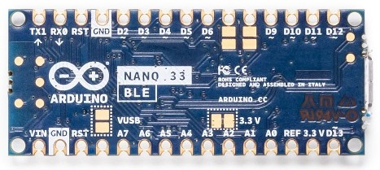

# Arduino Nano BLE 33 for Azure IoT Central

## Overview
This repository is part of a training and project series for Azure IoT Central. The name of the series is "Raspberry Pi Gateway and Arduino Nano BLE Devices for Azure Iot Central" and is located at...

[LINK: Training & Project Site for Raspberry Pi Gateway and Arduino Nano BLE Devices for Azure Iot Central](http://www.hackinmakin.com/Raspberry%20Pi%20Gateway%20and%20BLE/index.html)


### Arduino Nano 33 BLE
 

The Arduino Nano 33 BLE is an evolution of the traditional Arduino Nano, but featuring a lot more powerful processor, the nRF52840 from Nordic Semiconductors, a 32-bit ARM® Cortex™-M4 CPU running at 64 MHz. This will allow you to make larger programs than with the Arduino Uno (it has 1MB of program memory, 32 times bigger), and with a lot more variables (the RAM is 128 times bigger). 
The main processor includes other amazing features like Bluetooth® pairing via NFC and ultra low power consumption modes. The Nano 33 BLE comes with a 9 axis inertial measurement unit (IMU) which means that it includes an accelerometer, a gyroscope, and a magnetometer with 3-axis resolution each. This makes the Nano 33 BLE the perfect choice for more advanced robotics experiments, exercise trackers, digital compasses, etc.

The communications chipset on the Nano 33 BLE can be both a BLE and Bluetooth® client and host device. Something pretty unique in the world of microcontroller platforms. If you want to see how easy it is to create a Bluetooth® central or a peripheral device.

### Arduino Nano BLE 33 - PINOUT
 

## Setting up Your Development Toolchain
The code in this repository depends on Ardunio, Visual Studio Code and PlatformIO.

### Your Local Machine
The development "toolchain" refers to all of the various tools, SDK's and bits we need to install on your machine to facilitate a smooth experience 
developing our BLE devices and the Raspberry Pi Gateway device. Our main development tool will be Visual Studio code. It has dependencies on tools 
from Arduino and other open source projects, but it will be the central place where all our development will occur making it easy to follow along 
regardless of which operating system you are working on.

| - | Install These Tools |
|---|---|
|  | [LINK: Arduino Download Page](https://www.arduino.cc/en/Main/Software) - We will not be using the Arduino IDE directly in our project, but we do have dependencies on libraries and SDK's bits that get installed with the Arduino package. Install the complete Arduino IDE for your operating system. |
|  | [LINK: Visual Studio Code Installation Page](https://code.visualstudio.com/download) - Visual Studio Code is a lightweight but powerful source code editor which runs on your desktop and is available for Windows, macOS and Linux. This is the IDE we will use to write code and deploy to the our BLE Devices and the Raspberry Pi Gateway.  |
|  | [LINK: PlatformIO VS Code Install](https://platformio.org/platformio-ide) - PlatformIO is a cross-platform, cross-architecture, multiple framework, professional tool for embedded systems engineers and for software developers who write applications for embedded products. It works seamlessly with Visual Studio Code. |

Assuming everything is installed and working, Open Visual Studio Code and open the folder you cloned this repository into. You should see:


### Testing Your BLE Nano Device
You will want to have a BLE testing application installed on your phone. This will allow you communicate to the Nano board as a Central application. This is how we will test, see configuration and do some basic communications.

One of the more popular and easy to use is LightBlue. Here is the overview from the developer...


Apple Devices
[LINK: Light Blue - Apple App Store](https://apps.apple.com/us/app/lightblue/id557428110)

Andriod Devices
[LINK: Light Blue - Andriod App Store](https://play.google.com/store/apps/details?id=com.punchthrough.lightblueexplorer&hl=en_US)

LightBlue® can connect you to all of your devices that use Bluetooth Low Energy (also known as Bluetooth Smart, or Bluetooth Light).

LightBlue® has two modes, central and peripheral. In central mode, you can scan for and connect to all BLE devices around you. Once connected, you have a detailed view of all the device's profiles, from which you can read and write to characteristics and subscribe to notifications.

To enter BLE peripheral mode, navigate to the "Virtual Devices" tab and tap on the "+" icon to create a virtual device. When the blue checkmark is checked for a device, your iOS device is advertising as that particular BLE peripheral. LightBlue® allows you to customize the services and characteristics of any virtual peripheral profile. You can also clone any peripheral you connect to in central mode and save that profile to your list of virtual peripherals—simply connect to a device and tap on the "Clone" button on the top right of the screen.

Full support of read, write, and notify is included. You can view the signal strength (RSSI) to get an idea of how close you are to the peripheral.

The log tab allows you to keep track of all significant BLE events that occur while using the app (e.g., device discovery, connection, reading, writing), and you can share the content of the log.

Use LightBlue® to test your new BLE Heart Rate Monitor, temperature sensor, Microchip AVR-BLE and PIC-BLE development boards, TI CC2540 Keyfob, Nordic uBlue, Panasonic PAN1720, etc. LightBlue® is also ideal for developers wanting to test the firmware of their own BLE peripherals.

Key features:
* Scan and discover Bluetooth peripherals in the vicinity
* See basic device info (UUID, RSSI)
* Browse services and characteristics
* Register for notifications and indications
* Send data from notifications and indications to AWS IoT or Adafruit IO via our Cloud Connect feature
* Read values from characteristics
* Write to characteristics in Hex, Oct, Bin, Decimal or ASCII
* Clone peripheral profiles
* Choose from an array of common, preconfigured peripheral profiles
* Advertise as a peripheral using custom profiles
* Thoroughly log and share BLE events
* Custom UI and extended support for connecting to Microchip AVR-BLE and PIC-BLE development boards

## Connecting Your Board
The only thing required for this project to work with you Nano is to hook it up with a Mini-B USB cable. Once you plug it and are connected, the onboard power led will light up green.

If this is your first time programming an Arduino Nano board, I suggest you visit and try a couple samples via the Arduino IDE (which we have installed) just to take a test drive and make sure you have the working connection to your board.

[LINK: Getting started with the Arduino NANO 33 BLE](https://www.arduino.cc/en/Guide/NANO33BLE)

## Getting Started with the Ardunio BLE Library
The Ardunio Nano BLE 33 has a robust library for supporting Bluetooth Low Energy "Peripheral Clients" and "Central BLE" applications (like the Raspberry Pi Gateway we are creating in this training series).

I suggest that you read through the documentation as it is detailed and very well done. This will give you the foundation for the code we will be deploying to our device.

[LINK: ArduinoBLE library](https://www.arduino.cc/en/Reference/ArduinoBLE)


## The Code
Let's walk through the code and I will explain the capabilities. It is the simpliest of the sketches in the training and the other Nano devices expose more telemetry, properties and commands.

Overall the sketch is fairly simple. We have three elements we will be sending as Bluetooth characteristics from our Peripheral device.

* <b>Version</b> - single value, read only
* <b>Battery Status</b> - value from 1-10, read only
* <b>Telemetry Frequence</b> - 1000ms by default, read and write

This section sets up the pins we will be using for Led indication of status. These are all onboard Led's hosted on the Nano BLE 33. The onboard Led is Orange and shown with the orange box outline and the other is a 3 pin RGB Led with the RGB box outline.


```c++
/* --------------------------------------------------------------------------
    Leds we manipulate for Status, etc.
   -------------------------------------------------------------------------- */
#define ONBOARD_LED     13
#define RED_LIGHT_PIN   22
#define GREEN_LIGHT_PIN 23
#define BLUE_LIGHT_PIN  24
```

This section is where we define the UUID associated with the BLE Service advertisement.

```c++
/* --------------------------------------------------------------------------
    BLE Service Definition
   -------------------------------------------------------------------------- */
#define LAROUEX_BLE_SERVICE_UUID(val) ("6F165338-" val "-43B9-837B-41B1A3C86EC1")
BLEService blePeripheral(LAROUEX_BLE_SERVICE_UUID("0000")); 
```

In this section  we define our characteristics and set thier unique ID's...

```c++
 /* --------------------------------------------------------------------------
    BLE Service Characteristics - Readable by the Gateway
   -------------------------------------------------------------------------- */
BLEUnsignedIntCharacteristic  versionCharacteristic(LAROUEX_BLE_SERVICE_UUID("1001"), BLERead);
BLEFloatCharacteristic        batteryChargedCharacteristic(LAROUEX_BLE_SERVICE_UUID("2001"), BLERead | BLENotify | BLEIndicate);
BLEIntCharacteristic          telemetryFrequencyCharacteristic(LAROUEX_BLE_SERVICE_UUID("3001"), BLERead | BLEWrite| BLENotify | BLEIndicate);

BLEDescriptor versionCharacteristicDesc (LAROUEX_BLE_SERVICE_UUID("1002"), "Version");
BLEDescriptor batteryChargedCharacteristicDesc (LAROUEX_BLE_SERVICE_UUID("2002"), "Battery Charged");
BLEDescriptor telemetryFrequencyCharacteristicDesc (LAROUEX_BLE_SERVICE_UUID("3002"), "Telemetry Frequency");
```

This is the callback function we execute when Central sends a updated value for TELEMETRY_FREQUENCY

```c++
/* --------------------------------------------------------------------------
    Event Handler for Telemetery Frequency upadated from Central
   -------------------------------------------------------------------------- */
void telemetryFrequencyCharacteristicWritten(BLEDevice central, BLECharacteristic characteristic) {
  SetBuiltInRGB(HIGH, LOW, LOW); // blue
  delay(1000);
  Serial.print("Characteristic event - Telemetery Frequencey:");
  Serial.println(TELEMETRY_FREQUENCY);
  TELEMETRY_FREQUENCY = telemetryFrequencyCharacteristic.value();
}
```

Below we setup the BLE characteristics and when Central connects, we send telemetry for Battery Level and respond to writes to the TELEMETRY_FREQUENCY.

```c++
/* --------------------------------------------------------------------------
    Standard Sketch Setup
   -------------------------------------------------------------------------- */
void setup() {
  
  // Setup our Pins
  pinMode(RED_LIGHT_PIN, OUTPUT);
  pinMode(GREEN_LIGHT_PIN, OUTPUT);
  pinMode(BLUE_LIGHT_PIN, OUTPUT);
  pinMode(LED_BUILTIN, OUTPUT);

  Serial.begin(9600);    // initialize serial communication
  while (!Serial);

  // begin initialization
  if (!BLE.begin()) {
    Serial.println("Starting BLE Failed!");
    while (1);
  }
  
  /* 
    Set a local name for the BLE device
    This name will appear in advertising packets
    and can be used by remote devices to identify this BLE device
    The name can be changed but maybe be truncated based on space left in advertisement packet
  */
  BLE.setLocalName("LarouexBLE");
  BLE.setDeviceName("Larouex BLE Device 001");
  BLE.setAdvertisedService(blePeripheral);

  // add the services
  blePeripheral.addCharacteristic(versionCharacteristic); 
  versionCharacteristic.addDescriptor(versionCharacteristicDesc);
  versionCharacteristic.setValue(VERSION);
    
  blePeripheral.addCharacteristic(batteryChargedCharacteristic); 
  batteryChargedCharacteristic.addDescriptor(batteryChargedCharacteristicDesc);
  batteryChargedCharacteristic.writeValue(OLD_BATTERY_LEVEL);
  batteryChargedCharacteristic.broadcast();

  blePeripheral.addCharacteristic(telemetryFrequencyCharacteristic); 
  telemetryFrequencyCharacteristic.addDescriptor(telemetryFrequencyCharacteristicDesc);
  telemetryFrequencyCharacteristic.setValue(TELEMETRY_FREQUENCY);
  
  BLE.addService(blePeripheral);

  // assign event handler for Frequency Updates
  telemetryFrequencyCharacteristic.setEventHandler(BLEWritten, telemetryFrequencyCharacteristicWritten);

  /* Start advertising BLE.  It will start continuously transmitting BLE
     advertising packets and will be visible to remote BLE central devices
     until it receives a new connection */
  BLE.advertise();

  // Set leds to idle
  digitalWrite(LED_BUILTIN, LOW);
  SetBuiltInRGB(LOW, LOW, LOW);

  Serial.println("Bluetooth device active, waiting for connections...");
}

/* --------------------------------------------------------------------------
    Standard Sketch Loop
   -------------------------------------------------------------------------- */
void loop() {

  // listen for BLE peripherals to connect:
  BLEDevice central = BLE.central();

  // if a central is connected to peripheral:
  if (central) {
    
    digitalWrite(ONBOARD_LED, HIGH);
    Serial.print("Connected to central: ");
    // print the central's MAC address:
    Serial.println(central.address());

    // while the central is still connected to peripheral:
    while (central.connected()) {
      UpdateBatteryLevel();
    }

    // when the central disconnects, print it out:
    digitalWrite(ONBOARD_LED, LOW);
    SetBuiltInRGB(LOW, LOW, LOW);
    Serial.print(F("Disconnected from central: "));
    Serial.println(central.address());
  }
}
````